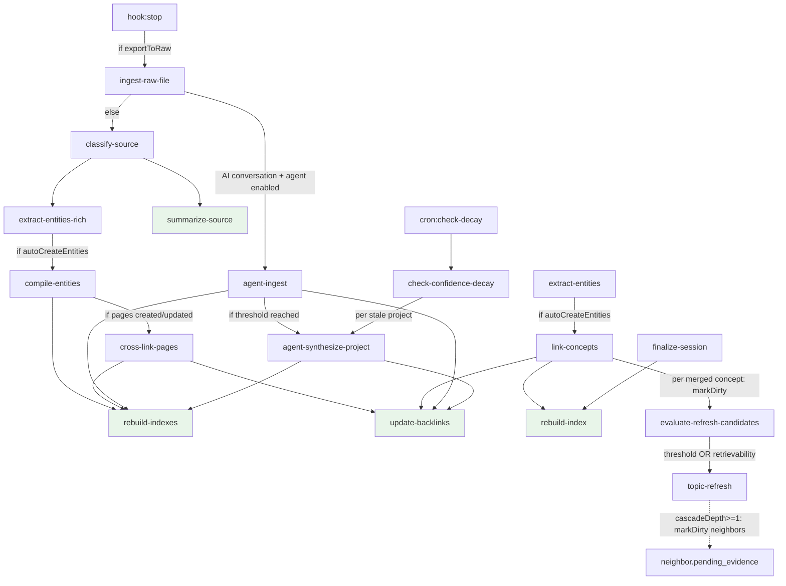

# Karpathy Second Memory Specification v2

## 1. Purpose

Karpathy Second Memory is a local-first, automatically maintained knowledge system that captures source material and AI work products, compiles them into a persistent Obsidian wiki, preserves provenance, maintains structure over time, and improves future work without requiring a separate retrieval stack.

The system exists to create compounding knowledge rather than transient chat history.

## 2. Normative language

The key words MUST, MUST NOT, REQUIRED, SHOULD, SHOULD NOT, and MAY in this document are to be interpreted as normative requirements.

## 3. Goals

The system MUST:

1. capture raw sources and AI work products;
2. compile them into a persistent Obsidian-based knowledge system;
3. maintain links, indexes, summaries, and relationships automatically;
4. capture Claude Code sessions into the vault automatically;
5. preserve provenance and auditability;
6. remain local-first and portable across tools;
7. remain repairable by a human using ordinary files on disk.

## 4. Non-goals

The system MUST NOT depend on:

- a vector database;
- embeddings as a required substrate;
- a cloud service for normal operation;
- a hidden mutable source of truth.

The system SHOULD minimize routine manual upkeep. Human review MAY be required for exception cases defined in this specification.

## 5. System of record

The system has four storage layers. All paths below are logical names. The actual filesystem paths are config-driven via `config.layout` in `~/.karpathy/config.json`. The default layout uses `wiki/`, `outputs/`, `raw/`, `review/` at vault root. The production layout uses `Curated/wiki/`, `Curated/sources/`, `AI Conversations/_summaries/`, etc. Code MUST always derive paths via `layoutFromConfig(config)` and `kindToFolder(layout, kind)` from `src/vault/paths.ts` — never hardcode layout-specific path strings.

### 5.1 `raw/` (logical: source evidence)

`raw/` is the immutable system of record for source evidence.

Rules:

- Files placed in `raw/` MUST be treated as evidence.
- Files in `raw/` MUST NOT be modified in place by automated processes.
- If normalization is required, the normalized artifact MUST be written elsewhere and linked back to the original raw artifact.

### 5.2 `wiki/` (logical: curated knowledge)

`wiki/` is the authoritative system of record for curated knowledge.

Rules:

- Pages in `wiki/` MUST contain structured, human-readable markdown.
- Curated knowledge MAY be updated by automation, subject to overwrite and review rules defined below.
- Every nontrivial claim in `wiki/` MUST carry provenance.

### 5.3 `outputs/` (logical: derived intermediates)

`outputs/` contains derived intermediate artifacts.

Rules:

- Files in `outputs/` MUST be treated as generated intermediates unless explicitly promoted.
- Promotion into `wiki/` MUST preserve a link to the source output artifact.

### 5.4 `CLAUDE.md` and agent config

`CLAUDE.md` is the derived hot cache for active context.

Rules:

- `CLAUDE.md` MUST NOT be treated as authoritative.
- `CLAUDE.md` MAY be regenerated.
- `.claude/` or equivalent configuration MUST be versioned and visible on disk.

### 5.5 Global operator config

Karpathy uses a single global config file at `~/.karpathy/config.json` rather than per-project config files.

Rules:

- The global config MUST contain a `defaults` block with at minimum a `vaultPath`.
- The global config MAY contain a `projects` map of absolute project paths to partial override objects merged shallowly on top of `defaults`.
- Hooks MUST silently skip (exit 0) when the global config is absent or `vaultPath` is not resolvable — hooks run globally and MUST NOT error in non-Karpathy projects.
- CLI commands MUST throw a `ConfigError` when the global config is missing or `vaultPath` cannot be determined.
- Per-project state directories (`.karpathy/state`, `.karpathy/locks`, `.karpathy/logs`) remain project-local and are resolved relative to the project root (cwd).

## 6. Memory model

### 6.1 Two-tier memory model

The system MUST implement a hot-cache and cold-storage split.

#### Hot cache

The hot cache is `CLAUDE.md` at the vault root or project root.

It MUST remain concise and MUST contain only currently useful context, including:

- active projects;
- key entities and aliases;
- current terminology;
- current constraints;
- operating rules;
- pointers to deep notes.

#### Cold storage

Cold storage lives under `wiki/`, `memory/`, or equivalent structured directories.

It MUST contain durable historical context, including:

- entity pages;
- project histories;
- session archives;
- source summaries;
- research notes;
- transcripts and artifacts.

### 6.2 Retrieval behavior

The runtime retrieval flow MUST be:

1. read `CLAUDE.md` first;
2. resolve against the hot cache where possible;
3. read only the minimum required deep notes or source pages;
4. update the hot cache and affected deep notes after the session.

## 7. Architectural lanes

The system MUST separate automated work into distinct lanes.

### 7.1 Deterministic maintenance lane

This lane handles operations that should be exact and reproducible.

Examples:

- backlink updates;
- index rebuilds;
- rename propagation;
- broken-link checks;
- metadata normalization;
- source-to-note mapping refresh.

### 7.2 Extraction and enrichment lane

This lane handles derived structured knowledge.

Examples:

- source summaries;
- entity extraction;
- concept extraction;
- decision extraction;
- open-question extraction;
- session summaries.

### 7.3 Heuristic review lane

This lane handles uncertain or inferential work products.

Examples:

- contradiction candidates;
- duplicate-page candidates;
- missing-concept proposals;
- low-confidence claim flags;
- alias-collision proposals.

The system MUST NOT silently treat heuristic review outputs as deterministic truth.

## 8. Event and job model

### 8.1 Event sources

The system MAY receive events from:

- file watcher events;
- periodic timers;
- Claude Code hook events;
- post-ingest batch completion events.

### 8.2 Job queue

Events MUST be normalized into jobs before write activity occurs.

Each job MUST include:

- `job_id`;
- `job_type`;
- `origin`;
- `target_paths`;
- `created_at`;
- `dedupe_key`.

### 8.3 Idempotency and debouncing

The system MUST be safe to re-run.

Specifically:

- semantically equivalent repeated events MUST deduplicate;
- generated writes MUST NOT immediately retrigger equivalent jobs without a debounce window;
- deterministic jobs MUST be idempotent;
- failed jobs SHOULD be retryable;
- poisoned jobs SHOULD be quarantined for operator inspection.

### 8.4 Concurrency and locking

The system MUST prevent concurrent conflicting writes.

At minimum:

- only one writer MAY hold a write lock per target note at a time;
- jobs touching overlapping notes SHOULD serialize;
- partial writes MUST NOT leave malformed markdown or frontmatter.

### 8.5 Job cascade graph

Jobs cascade: a handler may enqueue downstream jobs on completion. The full graph:



**Key properties:**

- Terminal jobs (green): `summarize-source`, `update-backlinks`, `rebuild-index`, `rebuild-indexes`, `detect-contradictions`, `detect-duplicates`, `detect-cross-project-patterns`, `generate-synthesis-skills`, `flush-hot-cache`, `lint-wiki`.
- Deduplication: `update-backlinks` and `rebuild-indexes` use `dedupeKey` + optional 5s debounce to collapse rapid cascades.
- Two ingest paths diverge at `ingest-raw-file`: deterministic (classify → extract → compile → crosslink) vs agent (agent-ingest → synthesize).

### 8.6 Cascading curation budget (Phase 0)

The curation pipeline is **write-time cheap, refresh-time batched**:

- Ingest MUST NOT rewrite linked concept pages directly. Linkers call
  `markDirty()` to record evidence on each touched concept's frontmatter.
- A `BudgetTracker` (per-tier daily LLM-call ceiling, configured via
  `intelligence.budget`) gates expensive refresh jobs. Handlers that need
  an LLM call SHOULD `tryReserve(tier)` first; on refusal, the handler
  re-enqueues for the next budget window or falls back to a cheaper path.
- LLM model selection is tiered (`config.llm.models.fast | medium | heavy`).
  Extraction, the significance gate, and stance/TL;DR classifiers route to
  `fast`; topic-refresh and conflict triage route to `medium`; weekly
  digests and deep-research synthesis route to `heavy`.
- The embedding store is content-addressable: `upsert` and `replaceDoc` skip
  the provider call when `(provider_id, chunk_hash)` is already present.
  `getCacheStats()` exposes hit/miss counters for observability.

### 8.7 Cascading curation cascade (Phase 1)

The full cascade for an existing concept that gains new evidence:

1. **Linker** (`link-concepts`) merges new evidence into a matched concept
   page. For each merged page, it calls `markDirty(page, ref=summaryPath,
   reason='new-evidence')` and enqueues `evaluate-refresh-candidates` with
   `dedupeKey: refresh-eval:${page}`. Newly created entity pages are NOT
   mark-dirtied (their content is already fresh).
2. **Threshold gate** (`evaluate-refresh-candidates`, deterministic, no LLM)
   reads the page's frontmatter:
   - `pending_evidence_count >= refresh.threshold` → enqueue `topic-refresh`.
   - else if `considerRetrievability` AND `R = exp(-Δt/S) < retrievabilityRefresh`
     AND `pending_evidence_count > 0` → enqueue `topic-refresh`.
   - else → no-op (the queue accumulates until the next ingest re-fires the gate).
3. **Refresh** (`topic-refresh`, medium-tier LLM) reserves one budget call,
   pulls evidence via retrieval, rewrites the `current-understanding`
   protected region, clears `pending_evidence`, stamps `last_verified`, and
   bumps `stability` (or halves it on contradictions). On budget refusal the
   job exits without modifying the note; the pending queue is preserved so
   the next ingest re-triggers the gate.
4. **Cascade depth-1** (default): after the refresh writes the new region,
   it extracts outlinks from `current-understanding`, resolves each to a
   vault path via the entity index, and calls `markDirty` on those neighbors
   with `reason='cascade-from-refresh'`. It does NOT auto-enqueue refreshes
   for neighbors — the threshold gate decides whether evidence has
   accumulated enough on the next cycle. Cascade depth is bounded at 1 by
   config (`refresh.cascadeDepth`); higher depths are deliberately not
   supported (storm risk).

## 9. Functional requirements

### FR-1 Ingest raw source material

When a file lands in `raw/`, the system MUST:

1. detect it;
2. classify it by supported source type;
3. register provenance to the raw file path;
4. create or update a source summary artifact;
5. extract candidate entities, concepts, decisions, and open questions;
6. update related deterministic graph structures where confidence permits;
7. append an audit log entry.

### FR-2 Capture Claude Code sessions

When Claude Code is used, the system MUST capture:

- the submitted prompt;
- compact summaries, if present;
- terminal or session outcomes, if available;
- major file changes;
- key decisions;
- action items;
- follow-up tasks;
- open questions.

The system MUST write a session note into the vault and MUST link it to affected projects, concepts, and evidence where possible.

### FR-3 Hook event support

The system MUST support:

- `UserPromptSubmit`;
- `PostCompact`;
- `SessionEnd`;
- `PostToolUse`.

`PostToolUse` support is REQUIRED in v1.

The implementation SHOULD suppress low-value repetitive logs, but it MUST preserve meaningful tool-use checkpoints affecting tracked knowledge.

### FR-4 Maintain deterministic structure automatically

The system MUST continuously maintain:

- backlinks;
- indexes;
- link integrity;
- rename propagation;
- alias tables;
- source-to-note mappings;
- change logs.

### FR-5 Preserve provenance

Every nontrivial curated claim in `wiki/` MUST include at least one provenance reference to:

- a raw file;
- a source summary;
- a transcript or session note;
- another curated page that itself carries provenance.

### FR-6 Support review and correction

The system MUST support a human review loop.

Human review MUST be required for:

- contradiction resolutions;
- merges of suspected duplicate canonical pages;
- alias merges that collapse canonical identities;
- destructive or lossy edits;
- edits to protected human-authored summary regions.

Human review SHOULD be optional for routine deterministic maintenance.

### FR-7 Background operation

The system MUST run without requiring routine manual kickoff.

The system MAY use:

- file watchers;
- timers;
- queue workers;
- Claude hooks;
- post-session tasks.

## 10. Data model

### 10.1 Base schema

Every managed note MUST support the following base frontmatter fields:

```yaml
---
id: string
type: string
title: string
status: draft | active | archived | rejected
confidence: low | medium | high
review_state: unreviewed | reviewed | approved | rejected
created_at: ISO-8601 timestamp
updated_at: ISO-8601 timestamp
last_maintained_at: ISO-8601 timestamp
source_refs: []
derived_from: []
aliases: []
links: []
change_origin: human | deterministic_maintenance | extraction | heuristic_review | hook_capture
protected_regions: []

# --- Phase 0: cascading curation (mark-dirty / lazy refresh) ---
pending_evidence: []          # [{ ref, reason?, at }] — unresolved evidence awaiting refresh
pending_evidence_count: 0     # cached length of `pending_evidence`; threshold-gated by evaluate-refresh-candidates
also_relevant_to: []          # absolute project paths that reference this concept (Phase 3 bridges)
---
```

The `pending_evidence` queue is the keystone of the cascading-curation model
(Phase 0 of the curation plan). Ingest MUST NOT rewrite a concept page's body
in the same transaction as new-source linking; instead, the linker calls
`markDirty(notePath, ref, reason?)` which appends to `pending_evidence`. A
later `evaluate-refresh-candidates` job consumes the queue under a budget and
threshold gate. The queue is bounded (`MAX_PENDING_EVIDENCE = 50`) and
idempotent on `(notePath, ref)`.

### 10.2 Canonical identity rules

- Every canonical entity, concept, project, and decision page MUST have a stable `id`.
- Aliases MUST map to a canonical page id.
- A rename MUST preserve canonical identity.
- Duplicate pages MUST NOT be silently merged without review.

### 10.3 Type-specific schemas

#### `source_summary`

Required fields:

- `source_type`
- `source_path`
- `ingest_status`
- `source_hash`

#### `session_summary`

Required fields:

- `source_type: claude_code`
- `session_id`
- `prompt_summary`
- `outcome_summary`
- `files_changed`

Note: `prompt_summary` and `outcome_summary` are populated by the session finalization path. When these fields are empty (e.g., session ended before finalization ran), tools MUST fall back to extracting content from the `%% begin:decisions %%` protected region within the note body. The `get_recent_sessions` MCP tool implements this fallback automatically.

#### `entity`

Required fields:

- `entity_kind`
- `canonical_name`

#### `project`

Required fields:

- `project_key`
- `project_status`

#### `decision`

Required fields:

- `decision_status`
- `decision_date` — when absent or empty, MUST fall back to `created_at` for display and sorting purposes.

#### `contradiction`

Required fields:

- `conflict_type`
- `claim_a`
- `claim_b`
- `resolution_state`

## 11. State transitions

### 11.1 Ingest state

Source ingest SHOULD follow this state flow:

`detected -> classified -> summarized -> extracted -> linked -> logged`

Failed ingest MAY transition to `failed` and SHOULD preserve diagnostic information.

### 11.2 Review state

Reviewable notes SHOULD follow:

`unreviewed -> reviewed -> approved`

Rejected review outputs SHOULD transition to `rejected` and MUST remain auditable.

## 12. Overwrite and edit policy

### 12.1 Raw evidence

Automation MUST NOT overwrite files in `raw/`.

### 12.2 Deterministic fields

Automation MAY update deterministic fields such as backlinks, index references, alias tables, metadata, and machine-managed sections.

### 12.3 Protected human-authored content

Automation MUST NOT overwrite protected human-authored regions except through an explicit approved review action.

Protected regions are delimited by Obsidian `%%` comment markers:

```
%% begin:region-id %%
content here
%% end:region-id %%
```

A region may be pinned with `%% pinned %%` inside the region body to prevent automated modification. The parser also accepts the legacy `<!-- PROTECTED:id -->` / `<!-- /PROTECTED:id -->` format for backward compatibility; any write operation auto-migrates to the `%%` format.

### 12.4 Destructive changes

Destructive or lossy edits MUST require review and MUST be restorable from diff, snapshot, or backup.

## 13. Classification definitions

### 13.1 Duplicate candidates

A duplicate candidate is a pair or set of notes that appear to represent the same canonical subject.

Duplicate candidates MAY be proposed automatically but MUST NOT be auto-merged.

### 13.2 Contradictions

A contradiction candidate is a pair of incompatible claims associated with overlapping subject identity and time scope.

The system SHOULD distinguish at least:

- direct factual contradiction;
- stale claim superseded by newer evidence;
- alias collision;
- interpretation conflict.

### 13.3 Low-confidence claims

A low-confidence claim is a generated claim lacking sufficient provenance, support, or extraction certainty.

Low-confidence claims SHOULD be surfaced for review rather than silently promoted.

### 13.4 Safe removal

A reference MAY be removed automatically only if:

- the target no longer exists or has been canonically replaced;
- provenance is preserved elsewhere;
- removal does not discard unique human-authored meaning.

## 14. Safety and security requirements

The implementation MUST:

- avoid blind overwrites;
- avoid destructive edits without backup or diff;
- avoid path traversal;
- quote shell variables;
- prefer absolute paths;
- keep a changelog of automated writes;
- separate raw evidence from curated knowledge.

This specification intentionally keeps security scope lightweight for the current phase. Expanded trust-zone and quarantine behavior MAY be added later.

## 15. Performance requirements

The system MUST work locally on a personal machine.

The implementation SHOULD:

- maintain low idle CPU;
- process incrementally rather than fully reindexing on every small change;
- batch near-simultaneous arrivals when useful;
- throttle maintenance runs;
- deduplicate repeated triggers;
- keep interactive note generation fast enough to feel immediate.

## 16. Observability requirements

The system MUST maintain operator-visible logs for:

- ingest activity;
- job execution;
- retries and failures;
- automated writes;
- review-required proposals.

The system SHOULD expose summary metrics for:

- files ingested;
- jobs processed;
- average ingest latency;
- failed jobs;
- backlog depth;
- review queue size.

### 16.1 MCP tool usage audit log

The MCP server MUST write one JSONL entry to `.karpathy/logs/mcp-usage.jsonl` for every tool call, regardless of success or failure.

Each entry MUST include:

- `ts` — ISO-8601 timestamp;
- `tool` — tool name as called;
- `args` — sanitized call arguments (content fields > 200 chars replaced with `[N chars]`);
- `duration_ms` — wall-clock execution time;
- `success` — boolean reflecting whether the call succeeded or returned `isError`;
- `result_chars` — total character length of the response;
- `result_count` — length of the returned JSON array if the result is an array (omitted otherwise);
- `error` — error message string when `success` is false.

The log MUST NOT throw or affect tool execution on write failure.

**The operator SHOULD review this log regularly** — at minimum after the first week of use and after any workflow change. The log is the primary signal for improving tool quality over time:

```bash
# Most-called tools
cat .karpathy/logs/mcp-usage.jsonl | jq -r '.tool' | sort | uniq -c | sort -rn

# All failures
cat .karpathy/logs/mcp-usage.jsonl | jq 'select(.success == false)'

# Slowest calls
cat .karpathy/logs/mcp-usage.jsonl | jq -s 'sort_by(.duration_ms) | reverse | .[0:10] | .[] | {tool, duration_ms, result_count}'

# search_vault queries (what was searched)
cat .karpathy/logs/mcp-usage.jsonl | jq 'select(.tool == "search_vault") | .args.query'

# Calls returning zero results
cat .karpathy/logs/mcp-usage.jsonl | jq 'select(.result_count == 0)'
```

These queries answer: which tools are being reached for, which return empty results, and whether tool descriptions are precise enough to route correctly.

## 17. Acceptance criteria

The build is complete only when the following criteria are met on a reference local machine and sample vault.

### AC-1 Raw ingest

A supported file dropped into `raw/` MUST produce or update a source summary and provenance entry within a defined target latency.

### AC-2 Session capture

A Claude Code session containing prompt submission, at least one meaningful tool interaction, optional compact summary, and session end MUST produce a session summary note containing the captured elements.

### AC-3 Deterministic maintenance

Backlinks, index pages, and rename propagation MUST remain internally consistent after repeated maintenance runs.

### AC-4 Review surfacing

Contradiction candidates, duplicate candidates, and low-confidence claims MUST be surfaced into a reviewable form and MUST remain auditable.

### AC-5 Long-running operation

The system MUST be able to run continuously for an extended period without requiring routine manual maintenance to preserve coherence of the vault.

### AC-6 Human usability

A user MUST be able to open Obsidian after normal work and see:

- a session summary;
- updated related pages where permitted;
- preserved provenance;
- an increasingly coherent knowledge structure.

## 18. Implementation phases

### Phase 1: Vault skeleton

Create the folder structure, templates, schemas, and operator-visible configuration.

### Phase 2: Job system and deterministic maintenance

Implement the event normalization layer, queue, locking, backlinks, index rebuilds, rename propagation, and machine-managed sections.

### Phase 3: Session capture

Implement Claude Code hook scripts for `UserPromptSubmit`, `PostToolUse`, `PostCompact`, and `SessionEnd`.

### Phase 4: Ingest pipeline

Implement raw-source detection, classification, source summaries, structured extraction, and provenance registration.

### Phase 5: Review workflow

Implement contradiction candidates, duplicate candidates, low-confidence flags, approval paths, and audit visibility.

### Phase 6: Optional MCP bridge

Expose the vault to AI tools through MCP only after the local workflow is stable.

MCP SHOULD begin with read-oriented operations. Expanded mutation behavior MAY be added later under explicit control.

## 19. MCP scope

The MCP server exposes 20 tools organized by function. Server instructions are derived at startup from the actual runtime vault layout so paths shown to the LLM match what is on disk.

### Search decision table

The server instructions MUST include a routing table telling the LLM which search tool to use for each goal:

| Goal | Tool |
|------|------|
| Orient at session start | `get_hot_cache` |
| Find notes by keyword | `search_vault` |
| Find a specific person/tool/project | `get_entity` or `search_entities` |
| Find semantically related notes | `get_related` |
| Surface past decisions | `get_decisions` |
| Recent session context | `get_recent_sessions` |

### Read tools (12)
- `get_hot_cache` — active context from the hotcache (CLAUDE.md or Curated/hotcache.md per layout); MUST be called first at session start;
- `search_vault` — full-text keyword search with stemming across all note types; ranking: title exact > title contains > title term hits > heading hits > body frequency; excludes `_index.md` category files; supports partial matching ("analysis" finds "analyses");
- `get_note` — read by exact path or title, with detail levels (metadata / summary / full);
- `get_recent_sessions` — session summaries sorted by date; when frontmatter `prompt_summary`/`outcome_summary` are unpopulated, automatically extracts from the `decisions` protected region;
- `get_entity` — direct lookup by name or path, with detail levels;
- `search_entities` — keyword search across entity notes ranked by relevance (title exact > title contains > term hits > body frequency); excludes `_index.md` files;
- `get_decisions` — decisions sorted by date; falls back to `created_at` when `decision_date` is unset; excludes `_index.md`;
- `get_review_queue` — items pending human review;
- `get_backlinks` — all notes linking to a target via wikilinks;
- `search_by_tags` — search notes by aliases, links, or tags (AND/OR);
- `get_related` — semantic similarity via Bedrock-Titan embeddings with recency boost (`α·sim + β·recency`); returns a clear fallback message when AWS credentials are expired, suggesting `search_vault` as an alternative;
- `batch_get_notes` — read multiple known notes in one round-trip, with detail levels.

### Write tools (4)
- `log_session_summary` — capture session summary, update hot cache;
- `log_insight` — create entity, concept, decision, project, or general note;
- `update_note` — merge frontmatter, replace or append body content (protected regions always preserved);
- `ingest_content` — ingest raw content through the pipeline.

### Maintenance tools (3)
- `run_maintenance` — update backlinks and rebuild indexes;
- `lint_vault` — health checks: orphan notes, broken links, stale notes, missing frontmatter, empty notes, duplicate titles;
- `approve_research` — approve pending research candidates from the research queue with depth selection.

### Utility tool (1)
- `vault_status` — aggregate counts by type, status, recent activity, review queue size.

All tools support detail levels (`metadata` / `summary` / `full`) where applicable, enabling token-efficient retrieval.

MCP MUST NOT become the primary source of truth.

### 19.1 Tool quality and the refinement loop

MCP tool quality degrades silently unless actively monitored. The operator MUST treat tool descriptions as living documentation:

1. **Review the usage log** after the first week of use and after any change in workflow (see §16.1 for queries).
2. **Identify zero-result searches** — queries that should have found something but returned nothing. These indicate stemming gaps, missing content, or tool routing failures.
3. **Identify routing failures** — where the LLM called the wrong tool. These indicate unclear `definition.description` text.
4. **Fix and rebuild** — update `definition.description` in the relevant tool file and `src/mcp/instructions.ts`, then `pnpm build`. The server picks up the new descriptions on next restart.

Tool descriptions MUST state: what search algorithm is used, what ranking means, what prerequisites exist (e.g. AWS credentials), and when to prefer this tool over alternatives. Vague descriptions ("search entities by kind or keyword") MUST be replaced with precise ones that help the LLM route correctly.

## 20. Required deliverables

The implementation deliverables MUST include:

- a working local Obsidian vault template;
- a session-capture hook script set;
- a maintenance worker;
- an ingest compiler;
- a review and repair pass for contradictions, duplicates, and link integrity;
- a clean README;
- a sample vault with example notes;
- Claude Code hook configuration;
- an operator guide.

## 21a. Intelligence layer (optional, additive)

An optional, opt-in intelligence layer is specified in [intelligence-plan.md](intelligence-plan.md) and implemented under `src/intelligence/` and `src/embeddings/`. It does NOT alter any of the goals, non-goals, or normative requirements above; it is purely additive and disabled by default for installs that prefer the deterministic substrate.

When enabled, the layer adds:

- **Time-aware frontmatter** (`last_verified`, `stability`, `half_life_domain`, `superseded_by`, `contradicts`, `tldr`, `hot_score`) — backfilled idempotently on first run;
- **Embedding store** at `.karpathy/state/embeddings.sqlite` with a pluggable provider (deterministic offline / Bedrock Titan production);
- **Two-stage retrieval with recency boost** powering the MCP `get_related` tool;
- **Weekly hot-topics digest** at `wiki/digests/{YYYY-Www}.md`;
- **Topic refresh** that integrates new evidence into a `current-understanding` protected region without overwriting contradictions;
- **Decay scan** that enqueues refreshes for stale concept / topic / decision notes;
- **Vault-rot diagnostic** at `wiki/_system/vault-health.md`;
- **Human-in-the-loop research handshake**: gap detection writes a stack-ranked queue at `wiki/_system/research-queue.md`; the user picks depth (light / medium / heavy / skip) via Slack reply, queue edit, or the MCP `approve_research` tool; only then does `research-execute` fire;
- **Significance gate** that drops generic / too-short entity names before they spawn noisy pages.

All artefacts produced by the layer respect the protected-region overwrite policy in section 12. The research handshake explicitly forbids autonomous web research without user approval.

## 21. Done definition

The system is done when a user can:

1. work in Claude Code normally;
2. generate useful session artifacts automatically;
3. open Obsidian and see the work summarized and linked;
4. trust that provenance and history have been preserved;
5. benefit from a knowledge base that improves without routine manual upkeep.

## 22. Curator reconciliation workflow

The system exposes an interactive reconciliation workflow for operators who want to improve entity quality: consolidate duplicates, fix name spelling, and resolve alias collisions without examining every file manually.

### 22.1 Reconciliation queue

The reconciliation queue persists at `{layout.system}/reconciliation-queue.md` inside a protected region. Each entry carries:

- `id` — nanoid stable identifier
- `status` — `pending` | `resolved` | `skipped`
- `sourcePath` / `targetPath` — candidate pair paths
- `sourceName` / `targetName` — display names
- `reason` — why the pair was flagged
- `confidence` — 0..1 score
- `decision` — `merge` | `rename` | `skip` | `manual` (set on resolution)
- `resolvedAt` — ISO timestamp (set on resolution)

The reconciliation queue file MUST be written at session start by `detect-entity-dupes` and is human-readable in Obsidian.

### 22.2 Detection

The `detect-entity-dupes` job:

1. Calls `detectMergeCandidates()` from `src/compilation/entity-merger.ts`.
2. Appends new candidates not already present in the queue — deduplication is on `sourcePath+targetPath` pair, order-normalized.
3. Does NOT remove or modify existing entries; their `status` is set only by operator decisions.

Running `detect-entity-dupes` twice MUST NOT create duplicate queue entries for the same pair.

### 22.3 Resolution paths

Three resolution paths exist:

**CLI (`karpathy curator`)** — interactive walk-through. For each `pending` entry, prints both entity names, the reason, and the confidence score, then prompts:

```
[m]erge  [r]ename  [s]kip  [M]anual  [q]uit
```

- `merge` — calls `mergeEntities(sourcePath, targetPath, vault)` then rebuilds backlinks and indexes. Marks entry `resolved` with `decision: merge`.
- `rename` — prompts for the new canonical name, calls `mergeEntities` with the renamed target, marks `resolved` with `decision: rename`.
- `skip` — marks entry `skipped`. Skipped entries are not shown again in future curator runs.
- `manual` — marks `resolved` with `decision: manual`; the operator handles it directly.
- `quit` — exits the interactive loop; unresolved entries remain `pending`.

**MCP (`reconcile_entities`)** — non-interactive, for in-session resolution. Without arguments, returns up to 10 pending queue entries. With `{ id, decision, newName? }`, applies the decision and returns the updated entry. Merge decisions execute `mergeEntities` and trigger backlink+index rebuilds.

**CLI (`karpathy merge`)** — existing direct merge command. Unchanged. Does not interact with the reconciliation queue.

### 22.4 Constraints

- `detect-entity-dupes` MUST be idempotent: running twice MUST NOT create duplicate entries.
- All merge decisions MUST use `mergeEntities()` — no alternative merge path is permitted.
- The reconciliation queue MUST NOT auto-apply merges without operator decision (the existing `karpathy merge --auto` is a separate explicit opt-in outside this workflow).
- After any merge triggered via `curator` or `reconcile_entities`, backlinks and indexes MUST be rebuilt.
- The `reconcile_entities` MCP tool MUST refuse to apply a `merge` decision if either path no longer exists (was already merged or deleted).

## 23. Manual content drop and re-enrichment

### 23.1 Clippings drop zone

`layout.clippings` (default: `clippings/`) is a designated drop zone for human-authored notes, research clippings, meeting notes, and any ad-hoc content the operator wants absorbed into the knowledge graph. Files added to this folder MUST be processed through the standard ingest pipeline:

`classify-source → summarize-source → extract-entities-rich → link-concepts → update-backlinks`

When `ingest.watchClippings` is `true` (default: `false`), the file watcher MUST include `{vaultPath}/{layout.clippings}` in its watch paths. New files trigger an `ingest-raw-file` job with the file path as payload.

Files ingested via clippings MUST follow the same provenance rules as `raw/` sources: a source summary is written, provenance is preserved, and all content outside protected regions is treated as evidence.

### 23.2 Re-enrichment of existing wiki notes

When an operator manually adds content outside protected regions to an existing wiki note, the system MUST provide a mechanism to re-trigger entity extraction and concept-linking without a full ingest.

**`re-enrich-note` job** — given a `targetPath` (a vault note path):

1. Reads the note's full body.
2. Strips all machine-owned protected region content (any `%% begin:id %%` block listed in the note's `protected_regions` frontmatter field) to isolate the human-authored text.
3. If the stripped text has fewer than 50 characters, completes as a no-op (no enrichment).
4. Otherwise: runs `extractEntitiesRich()` on the stripped text.
5. For each non-noise extracted entity, enqueues `link-concepts` (deduped by entity path).
6. Enqueues `update-backlinks` for `targetPath` (deduped).
7. Updates `last_verified` to the current ISO timestamp and `updated_at` in frontmatter.

The job MUST NOT overwrite any protected regions during re-enrichment. Only the downstream `update-backlinks` job MAY update the `backlinks` protected region.

**CLI (`karpathy touch <note-path>`)** — resolves `note-path` relative to the vault root, enqueues a `re-enrich-note` job, and drains the queue. Prints a summary of jobs processed.

**MCP (`re_enrich_note`)** — accepts `{ notePath }` (vault-relative path). Enqueues `re-enrich-note` and drains the queue. Returns a summary of what changed.

### 23.3 Constraints

- Re-enrichment MUST NOT delete or overwrite human-authored content outside protected regions.
- `last_verified` MUST be updated to the current ISO timestamp after successful re-enrichment (even for no-op enrichment — the note was "verified" as of that moment).
- If entity extraction produces no results, the job completes successfully — no-op enrichment is valid.
- Re-enrichment of a note that does not exist in the vault MUST fail with a clear error, not silently succeed.

